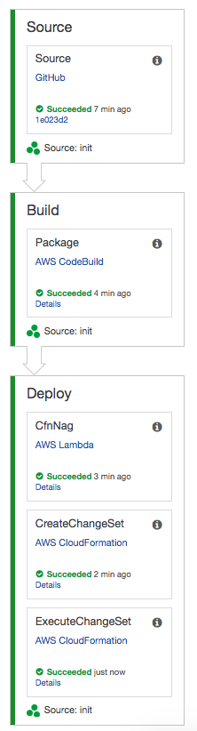

# Overview
This repo contains a simple API written in Go that runs as a Lambda function behind API Gateway.  The `toolchain` directory contains CodePipeline and CodeBuild spec files to define a continuous delivery pipeline for provisioning the API.  

Additionally, the pipeline leverages [cfn_nag](https://github.com/stelligent/cfn_nag) to fail the pipeline if violations are detected.

# Prerequisites
This pipeline leverages the [cfn-nag-pipeline](https://serverlessrepo.aws.amazon.com/applications/arn:aws:serverlessrepo:us-east-1:923120264911:applications~cfn-nag-pipeline) application in Amazon Serverless Application Repository.  You must install that application before deploying the pipeline for this sample application.

# Pipeline
To provision the pipeline, fork this repo and then run the following with your GitHub personal access token:

```
cd toolchain
make deploy GITHUB_TOKEN=xxxxxxxxxxxxx GITHUB_USER=your_user_name
```


